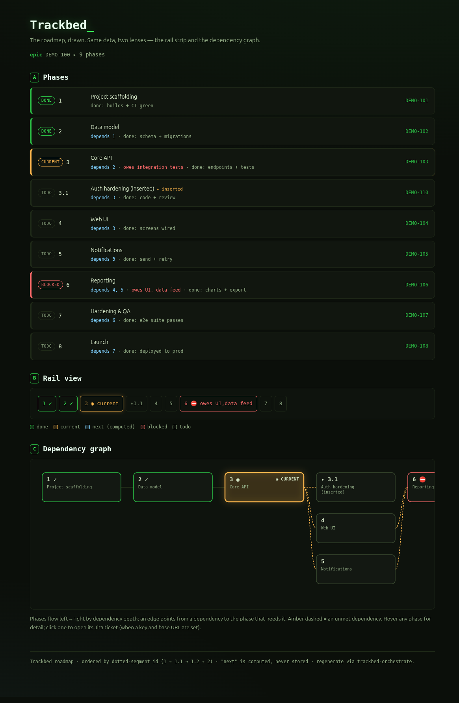

# Trackbed

**Keep the rails, lose the train.**

Trackbed is a thin **roadmap + status + orchestration** layer for working through a body of work — a Jira **epic** or a standalone **project**. It is implemented entirely as **skills** (plus a thin slash command on the runtimes that need one) for Claude Code, OpenCode, and GitHub Copilot CLI: no scripts, no Python, no hooks.

It keeps the one genuinely valuable thing from heavier planning frameworks — the **route and manifest** (ordered phases, dependencies, "what's owed", per-phase memory) — and lets a lightweight executor (Superpowers, vanilla Claude Code, OpenCode, or a Copilot agent) drive each phase. Trackbed owns *where you are and what's next*; it never implements a phase itself.

---

## Why

Trackbed started as a question about [GSD](https://github.com/glamp/get-shit-done): which part of it is actually valuable, and which part is just machinery you have to adopt wholesale? The valuable part is the **route and manifest** — an ordered set of phases with dependencies, explicit done-criteria, "what's owed", and per-phase memory that carries forward across the whole epic. The machinery is the heavy, opinionated execution engine bolted to it. Trackbed keeps the first and drops the second: **keep the rails, lose the train.**

That split is what makes it **resilient about the executor**. Trackbed never implements a phase itself — it owns the roadmap and hands each phase to whatever you prefer to drive planning, design, and implementation: [Superpowers](https://github.com/obra/superpowers), vanilla Claude Code, OpenCode, or a Copilot agent. The roadmap stays the single source of truth the executor can't jump off — "the rails the car can't jump."

For Superpowers specifically, this fills the one gap it has. Superpowers is excellent at planning and executing a **single feature** — `writing-plans` produces one plan file of bite-sized tasks, and `executing-plans` / `subagent-driven-development` walk them. But that plan is scoped to one feature; there is no layer **above** it that orders many features/stories, tracks dependencies between them, and remembers where you are across the whole epic.

You *could* try to stretch one plan across an entire application by treating each whole feature as a single "task" — but that fights the tool. Superpowers' tasks are deliberately bite-sized (a file or two, one commit, test-driven in a sitting), and even if you forced features into that mold you'd get a flat checklist with no dependencies between features, no per-feature memory, and no durable manifest re-read as the source of truth. That's a to-do list, not a roadmap. The two operate at different altitudes: Superpowers works **within** a feature; Trackbed works **across** features. That cross-feature roadmap is exactly what Trackbed supplies — so Superpowers keeps doing what it does best, and Trackbed gives it the route to follow.

## How it works

Trackbed has two stages:

1. **Initialization** (optional, run-once) — turns an epic or project into a roadmap through an ordered pipeline: an optional **PRD** (read or drafted), an optional **ADR** pass (read existing decisions, or gap-fill new ones — `read` / `read-create` / `skip`), the **roadmap** itself, and **tickets** where applicable. Skippable if a roadmap already exists.
2. **Orchestration** (ongoing) — owns the roadmap + status + per-phase notes, computes the next unblocked phase, hands it to the executor, records progress, and absorbs runtime changes to the roadmap.

### Anchors

Every roadmap hangs off an **anchor**:

- **`epic`** — keyed by a Jira epic key (e.g. `DEMO-100`). Phases map to Jira stories; ticketing is part of the flow.
- **`project`** — keyed by a slug (e.g. `acme-app`) for a small app with no epic. Phases are local stories/tasks; **Jira is optional**. No fake/dummy epic is ever created.

The anchor key names the working directory `.trackbed/<key>/`.

## Components

One planning front door, two hidden internal skills, and a shared ADR specialist:

| Skill | Invocability | Role |
|---|---|---|
| `trackbed` | **user-invocable** | Front door. Determine the anchor (epic/project), route to init or orchestrate. Pure dispatcher. |
| `trackbed-init` | hidden (`user-invocable: false`) | One-time planning: PRD → ADR → roadmap → tickets, and lock the storage format. Skippable. |
| `trackbed-orchestrate` | hidden (`user-invocable: false`) | Living roadmap + status + notes; compute next phase; hand off; record; absorb runtime mutations. |
| `trackbed-adr` | **user-invocable** (shared) | Read existing ADRs, gap-fill new ones. Used by init, or run standalone on a story/epic/project that needs only ADRs — no roadmap required. |
| `trackbed-view` | **user-invocable** | Open the roadmap viewer in the browser — regenerates a self-contained HTML page (phase board + rail + dependency graph) from the live roadmap, then opens it. Read-only. |

## Usage

```
/trackbed <jira-epic-key | project-slug>
```

- `/trackbed DEMO-100` — start or resume Trackbed on a Jira epic.
- `/trackbed acme-app` — start or resume a standalone project roadmap (no epic).

The front door reads the anchor, checks for an existing roadmap under `.trackbed/<key>/`, then routes to **init** (if nothing exists) or straight to **orchestration** (if a roadmap is already there).

> A single Jira **story** has no roadmap — Trackbed does not apply to it. Stories go straight to execution; they may borrow `trackbed-adr` standalone for decision intake. `trackbed-adr` also runs standalone on an epic or project when you only want ADRs surfaced or created and aren't building a roadmap.

## Visualization

The roadmap is just data — so Trackbed can draw it. `trackbed-view` regenerates a **single self-contained HTML file** (`.trackbed/<key>/roadmap.html`) from the live roadmap and opens it in your browser. No build, no server, one file. It renders three lenses of the same data: a **phase board** (story name + colour-coded status + Jira key — state and the phase↔ticket mapping made visual), a **rail strip**, and a **dependency graph** with the current phase highlighted.



It stays in sync automatically: `trackbed-orchestrate` regenerates the file on every status change or roadmap mutation, and `/trackbed-view <key>` opens it on demand between turns. The viewer is always a projection of the roadmap — never a second source of truth.

## The format switch

The storage format is chosen **once** during init and **locked** for the life of the roadmap:

- **GSD mode** — roadmap / status / notes live in GSD's `.planning/` files (`ROADMAP.md`, `STATE.md`). Trackbed reads and updates them but never alters GSD's roadmap format.
- **Native mode** — roadmap / status / notes live in `.trackbed/<key>/`:
  - `roadmap.yml` — ordered phases (the phase's `jira:` field *is* the phase↔ticket mapping)
  - `state.yml` — cross-phase digest: current position, blockers, session continuity (re-read first every turn)
  - `notes/` — per-phase memory (or inlined per phase in `roadmap.yml`)

The per-roadmap **`manifest.yml`** is always Trackbed-owned and exists in both modes — it records the anchor, key, locked format, ADR mode, and artifact paths. `trackbed-orchestrate` reads it first on every resume.

Phases are walked in **dotted-segment id order** (like version numbers): `3 → 3.1 → 3.2 → 3.2.1 → 3.3 → 4`. `depends` gates eligibility; the id order sets the walk. "Next" is computed each turn — never a stored status.

## Hard rules

1. **No mid-roadmap format switching.** GSD vs native is chosen once and locked.
2. **Firewall.** Team-facing outputs (Jira tickets, PRD, ADRs) stay framework-neutral — plain domain language, no GSD/Trackbed vocabulary, no `.planning/` or `.trackbed/` paths. The phase↔ticket mapping never leaks into Jira.
3. **Always ask before writing to Jira.** Never auto-create or auto-link a ticket. Under a `project` anchor, Jira may be unused entirely.
4. **Skills-only.** No scripts, no Python, no hooks. The roadmap file is the single source of truth and is always re-read, never trusted from stale memory.
5. **One front door for planning.** `trackbed` is the planning entry point; `trackbed-init` and `trackbed-orchestrate` are hidden (`user-invocable: false`) and reached only through it. `trackbed-adr` is the exception — user-invocable and runnable standalone.

## Lifecycle

`.trackbed/` (and `.planning/`) is internal scaffolding — noise to a code reviewer. It **stays git-tracked through development** (never gitignored — an untracked dir is liable to be deleted as noise) and is **removed manually at the very end**, just before the final PR.

**Durable / team-facing** (survive the PR): the code, the PRD, the ADRs, and the Jira tickets.

## Installation

Run the installer and pick your runtime(s) — Claude Code, OpenCode, GitHub Copilot CLI, or any combination:

```bash
git clone https://github.com/Orfi/trackbed.git
cd trackbed
./install.sh
```

The installer asks which runtime(s) to install for. Pick one or more — type a single number, or several separated by a space or comma:

```
Install for which runtime(s)?
  1) Claude Code
  2) OpenCode
  3) GitHub Copilot CLI
Select one or more (e.g. '1', '3', or '1 2 3' / '1,2' for several).
Choice: 1 2 3
```

| Flag | Effect |
|---|---|
| *(none)* | Copy the skills + command into place |
| `--link` | Symlink instead of copy — repo edits go live (dev) |
| `--uninstall` | Remove an existing Trackbed install (prompts for runtime the same way) |
| `--help` | Show usage |

Then invoke `/trackbed <jira-epic-key | project-slug>` in any installed runtime.

### Layout

The skills are markdown (`SKILL.md` + YAML frontmatter). The repo keeps a separate surface per runtime:

```
claude/                       # Claude Code surface
├── commands/trackbed.md
└── skills/
    ├── trackbed/SKILL.md
    ├── trackbed-init/SKILL.md
    ├── trackbed-orchestrate/SKILL.md
    ├── trackbed-adr/SKILL.md
    └── trackbed-view/        # SKILL.md + roadmap-template.html (the viewer)
opencode/                     # OpenCode surface (command only — skills shared with claude/)
└── commands/trackbed.md
copilot/                      # GitHub Copilot CLI surface (own skill copy, executor text adapted)
└── skills/ (trackbed, trackbed-init, trackbed-orchestrate, trackbed-adr, trackbed-view)
viz/roadmap.html              # the roadmap viewer template (sample data, opens standalone)
install.sh
```

Claude Code and OpenCode share one skill source (`claude/skills/`) — only the command file format differs. Copilot CLI keeps its **own** copy (`copilot/skills/`) because its executor differs and, in Copilot, a skill *is* its slash command — so there is no command file.

### Where things land

The skills are shared across runtimes; only the command file differs in format. To avoid the two skill homes drifting (OpenCode reads **both** `~/.claude/skills/` and `~/.config/opencode/skills/`), the installer puts skills in exactly **one** home per machine:

| You install for | Skills | Command |
|---|---|---|
| Claude Code only | `~/.claude/skills/` | `~/.claude/commands/trackbed.md` |
| OpenCode only | `~/.config/opencode/skills/` | `~/.config/opencode/commands/trackbed.md` |
| Claude Code + OpenCode | `~/.claude/skills/` *(OpenCode reads it natively)* | both command files |
| GitHub Copilot CLI | `~/.copilot/skills/` | *(none — the skill is the command)* |

On an OpenCode-only machine, Claude Code need not be installed — `~/.claude/skills/` is just a path OpenCode also reads; the installer uses the OpenCode-native path instead. Copilot is independent of both: it has its own home (`~/.copilot/skills/`) and never shares or collides with the Claude/OpenCode skill paths.

## Versioning

Trackbed follows [Semantic Versioning](https://semver.org). Releases are git tags (`v0.1.0`, …) with notes in [`CHANGELOG.md`](CHANGELOG.md). To update an install, `git pull` and re-run `./install.sh`.

## Status

Spec and skills authored. See [`trackbed-spec.md`](trackbed-spec.md) for the full specification and [`Trackbed-idea.html`](Trackbed-idea.html) for the original "rails without the train" concept brief.

### Out of scope (parked)

- QML visualization (DAG / Gantt lenses).
- Acme App integration — Trackbed ships standalone first; the app can read the same files later.
- Pulling actuals from Jira (sprint dates) for a real Gantt.
